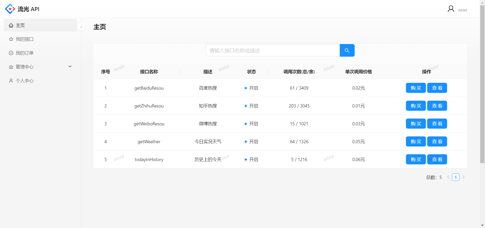
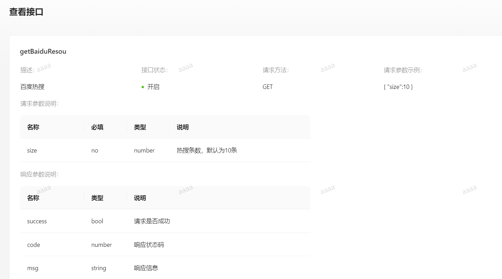
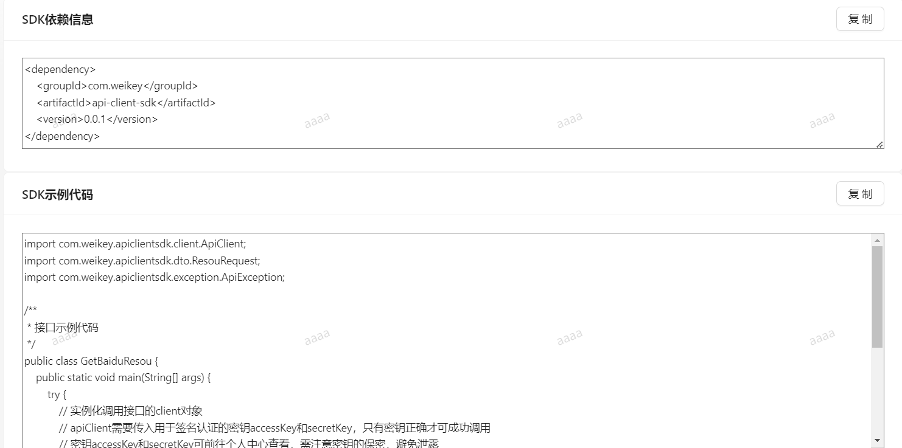
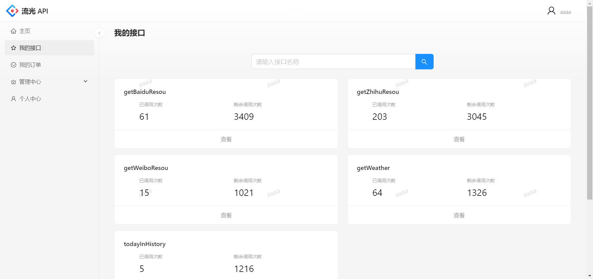
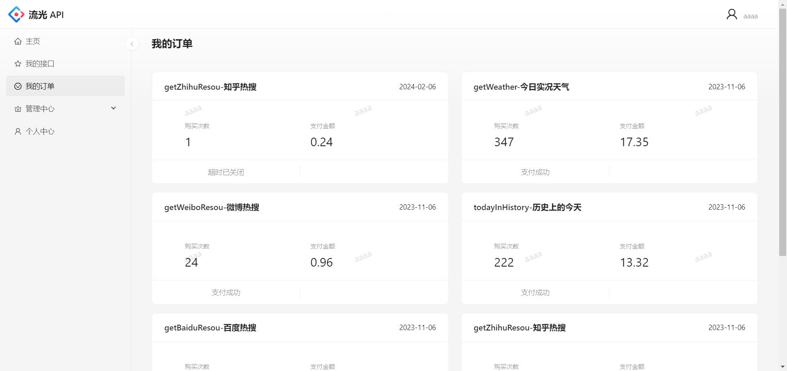
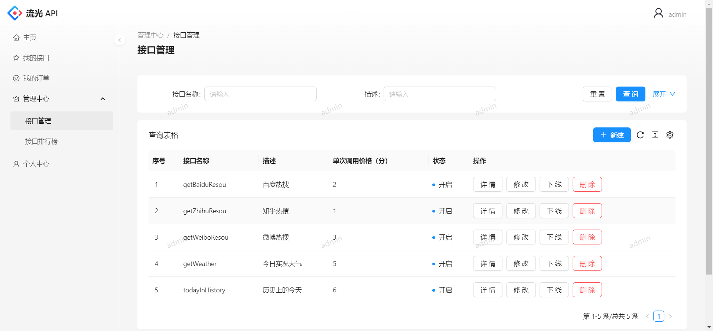
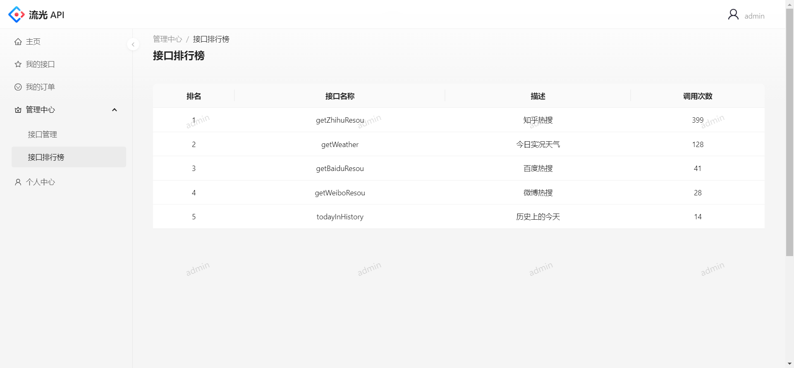
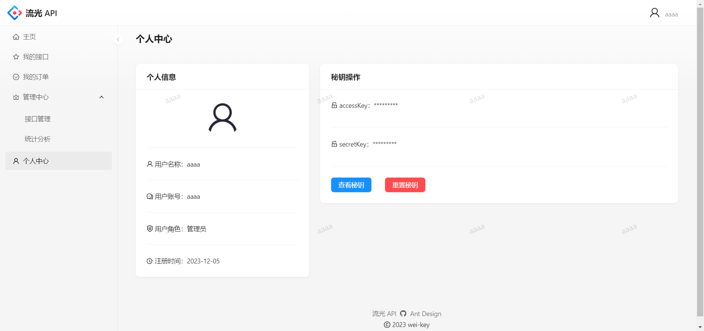
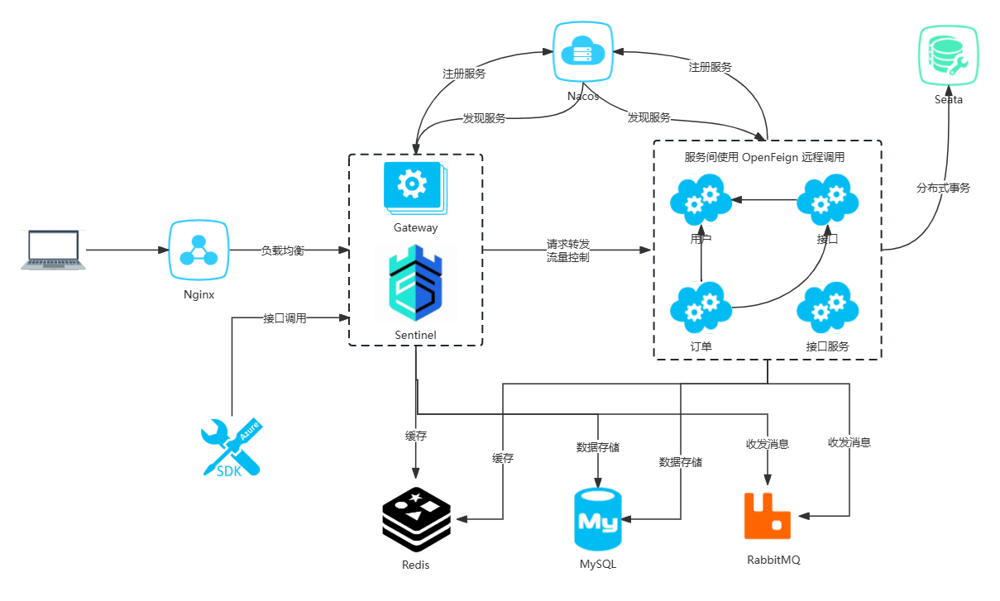

# 流光 API

> 安全、稳定、便捷的 API 调用平台
> 
> 在线体验：todo

## 💎项目介绍

本项目旨在为开发者提供安全、稳定、便捷的接口调用服务，开发者可以使用平台提供的 SDK 轻松完成接口的调用。

此外，平台支持接口文档查看、接口在线调试等功能，平台管理员可以进行接口管理、接口发布/下线等操作。

## 🚀项目展示

主页：浏览接口信息，购买接口，查看接口文档，搜索接口



接口文档：接口详细信息（请求/响应参数等），SDK（依赖信息、示例代码），在线调用





我的接口：查看已开通接口（已调用次数、剩余调用次数），搜索接口，查看接口文档



我的订单：查看购买接口的订单（购买次数、支付金额、订单状态），取消订单



接口管理：接口增删改查，发布/下线接口



接口排行榜：统计各接口调用次数，进行排序展示



个人中心：查看个人信息，查看密钥，重置密钥




## 🌟功能模块

- 用户
    - 登录、注册
    - 查看密钥
    - 重置密钥
- 接口
  - 普通用户
    - 浏览接口
    - 查看接口文档
    - 搜索接口
    - 接口在线调试
    - 购买接口
    - SDK 调用接口：API 签名认证保障调用的安全性
    - 查看已开通接口：已调用次数、剩余调用次数
  - 管理员
    - 查看接口详情
    - 搜索接口
    - 新增接口
    - 删除接口
    - 修改接口信息
    - 发布/下线接口
    - 接口调用次数的统计分析
- 订单
  - 接口购买支付：支持支付宝支付（沙箱）
  - 创建订单
  - 订单超时取消
  - 查看订单（购买次数、支付金额、订单状态）
  - 取消订单

## 🚩系统架构



## 🔧技术选型

### 前端

- 开发框架：React、Umi
- 脚手架：Ant Design Pro
- 组件库：Ant Design、Ant Design Components
- 语法扩展：TypeScript、Less
- 打包工具：Webpack
- 代码规范：ESLint、StyleLint、Prettier

### 后端

- 主语言：Java
- 框架：Spring Boot、Spring Cloud、MyBatis-Plus
- 数据库：MySQL、Redis
- 消息队列：RabbitMQ
- 注册中心：Nacos
- 服务调用：OpenFeign
- 网关：Spring Cloud Gateway
- 流量控制：Sentinel
- 分布式事务：Seata
- 负载均衡：Spring cloud Loadbalancer
- 身份认证：Json Web Token
- 接口文档：Knife4j
- 构建工具：Maven

## 📕项目模块

- liuguang-api-frontend：项目前端
- liuguang-api-common：公共模块，包括公共实体、公共常量、全局异常处理器、Feign 客户端、公共工具类等
- liuguang-api-gateway：网关模块，**统一处理跨域、用户鉴权、聚合文档、黑白名单、内网服务保护、签名校验、流量控制等问题**
- liuguang-api-interface：接口模块，包括接口增删改查、发布/下线接口、接口在线调试等功能
- liuguang-api-interface-service：接口服务模块，用户使用 SDK 调用的接口来源于此模块
- liuguang-api-order：订单模块，包括接口购买、订单取消等功能
- liuguang-api-sdk：提供给开发者用于调用接口的 SDK
- liuguang-api-user：用户模块，主要包括登录、注册、重置密钥等功能

## ✈️快速上手

### 后端

1. 使用`mvn install`将 liuguang-api-common、liuguang-api-sdk 安装到本地仓库
2. 修改各模块的配置文件，将 MySQL、Redis、RabbitMQ 的连接信息修改成你本地的
3. 启动 Nacos、MySQL、Redis、RabbitMQ
4. 启动各模块

### 前端

环境要求：Node.js >= 16

安装依赖：

```
yarn
```

项目启动：

```
npm run start:dev
```

## 🤝欢迎贡献

对于项目的 bug、细节优化或者其他建议，欢迎在 Issues 区留言